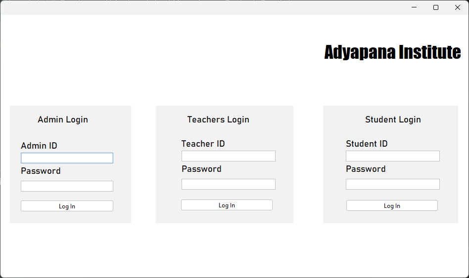
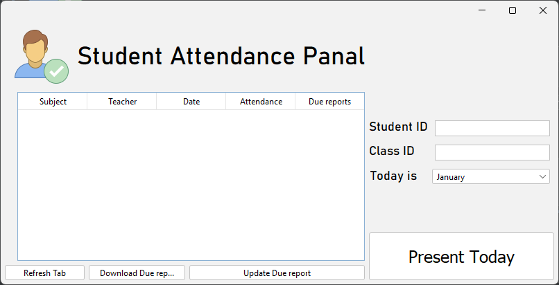
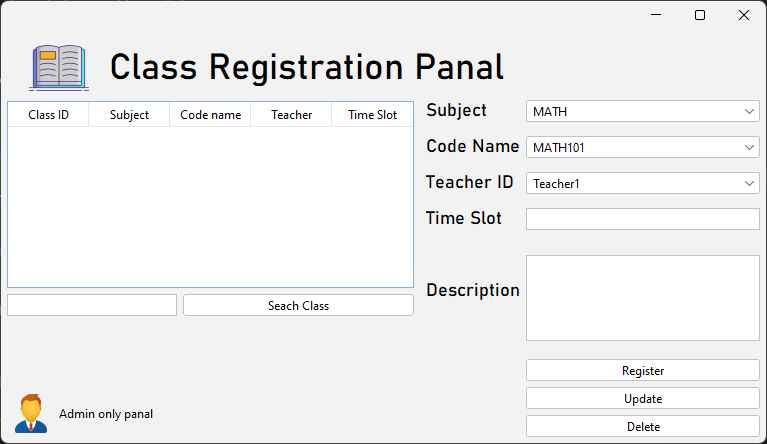
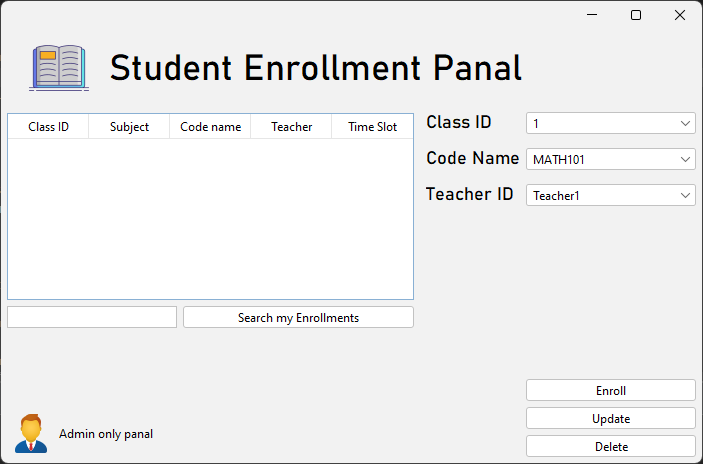
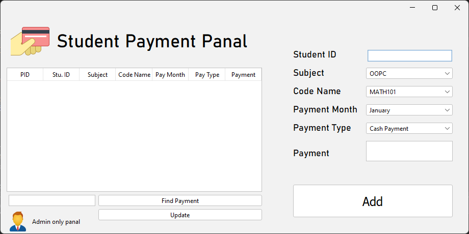
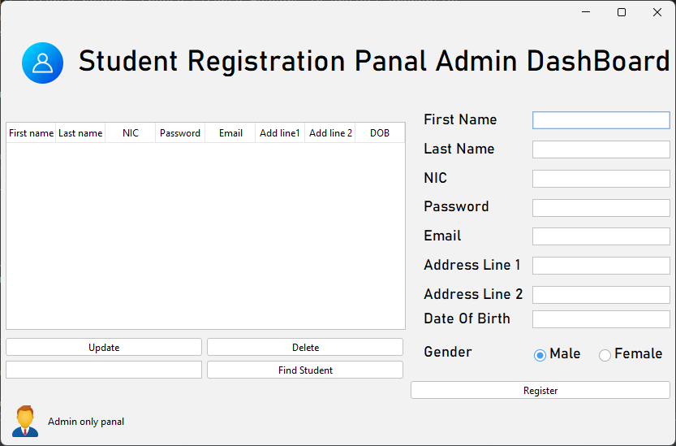
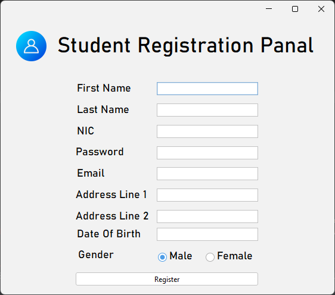
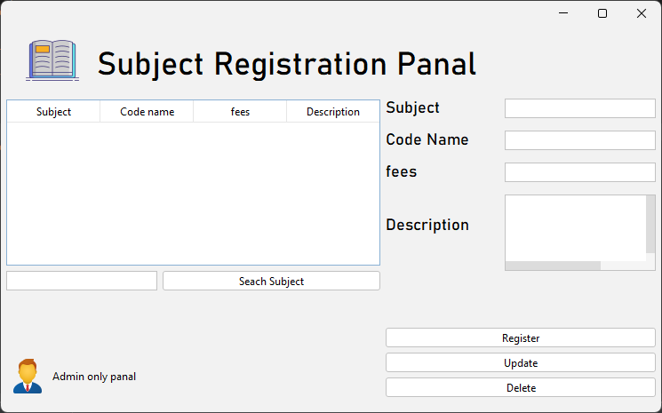
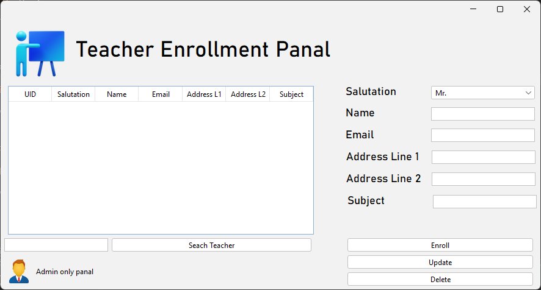

# Adyapana Institute LMS

This is a SAD project of creating LMS using Netbeans IDE.
  
# UI

### Home panel

### Students marking attendance panel

### Class registration Panal

### Student Enrollment panal

### Student payment panal

### Students Registration details Editing Admin panel

### Students Registration panel

### Subject registration panel

### Teachers enrollment panal

### Java file tree

